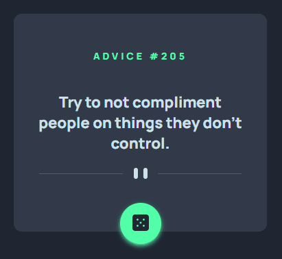

# Advice generator app

## O desafio! 

Desafio disponibilizado pela plataforma [Frontend Mentor](https://www.frontendmentor.io/challenges)

## Tecnologias utilizadas

- HTML 
- CSS
- Javascript

## Detalhes do projeto

O projeto é um gerador de conselhos. Foi feito toda a estrutura, com responsividade para telas pequenas:

Este projeto está consumindo a API [ADVICE SLIP API](https://api.adviceslip.com/), portanto, este projeto concluiu todas as etapas exigidas.

### Dificuldades
1. Requisição para a API, utilizando o Fetch. 
2. Inserir os dados coletados da API, direto no HTML

### Demonstração do Projeto
