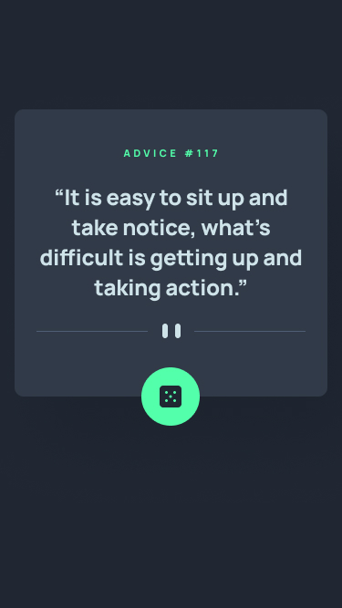

# Advice generator app

## O desafio! 

Desafio disponibilizado pela plataforma [Frontend Mentor](https://www.frontendmentor.io/challenges)

## Tecnologias utilizadas

- HTML 
- CSS

## Detalhes do projeto

O projeto é um gerador de conselhos. Foi feito toda a estrutura, com responsividade para telas pequenas:

Futuramente, este projeto será utilizado nas aulas de Javascript para consumir API.